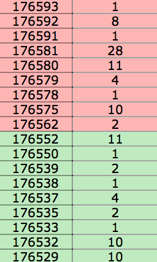

# Глоссарий

 - `Биржа` – юридическое лицо, обеспечивающее регулярное функционирование организованного рынка биржевых товаров, валют, ценных бумаг и производных финансовых инструментов.

 - `Финансовый инструмент` – договор, по которому стороны получают право или берут обязательство выполнить некоторые действия в отношении базового актива. В качестве базового актива могут выступать товары, валюты, ценные бумаги и т.д.

 - `Фьючерс` (от англ. «futures») – производный финансовый инструмент, стандартный срочный биржевой контракт купли-продажи базового актива, при заключении которого стороны (продавец и покупатель) договариваются только об уровне цены и сроке поставки.

 - `Лот` – минимально возможная единица финансового инструмента, участвующая в торгах.

 - `Биржевой стакан` (order book) – это таблица заявок (ордеров) на покупку и продажу некоторого инструмента. Каждая заявка представляет собой пару <цена, количество>. Биржевой стакан отображают, как правило, в виде таблицы, где снизу вверх расположены заявки на покупку (отмечены зеленым цветом на картинке), упорядоченные по возрастанию цены, и затем заявки на продажу (отмечены красным цветом)

 - `Бид` (от англ. «bname» – предлагать) -- заявка на покупку.

 - `Аск` (от англ. «ask» – запрашивать) -- заявка на продажу.

 - `Спред` (от англ. «spread» – разница, разброс) -- разность между между ценами лучших заявок на продажу и на покупку.

 - `Сделка` -- сведение (исполнение) заявки с соответствующей заявкой встречного направления, то есть покупка/продажа объема, не превыщающего указанного в заявке, по ее цене. Сведение может быть как частичным (объем меньше объема заявки), так и полным.

 - `Позиция по инструменту (поза)` -- количество лотов “на руках” участника торгов.

 - `Сальдо` -- баланс всех сделок, совершенных участником, в денежном эквиваленте. Если участник торгов сначала купил 10 лотов инструмента по цене 100, а потом продал 5 лотов по цене 103, то текущая поза будет равна 10-5 = 5, а текущее сальдо -10*100 + 5*103 = -485.
 
