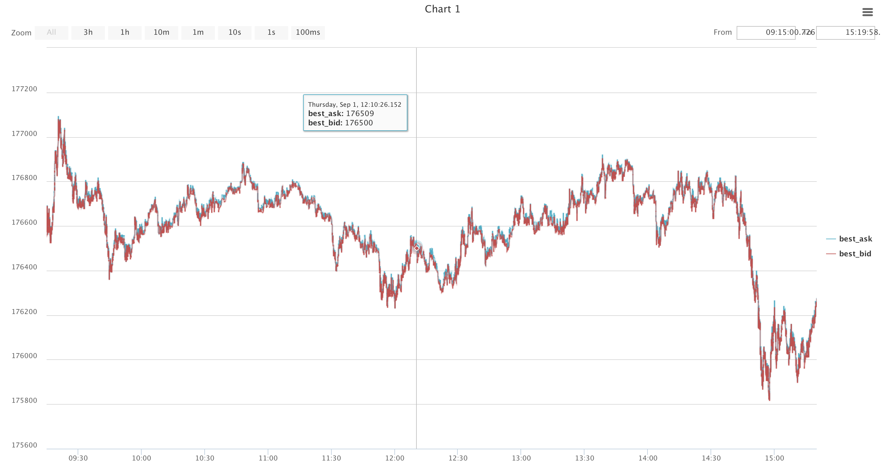

### Графики
По умолчанию для каждой тренировочной посылки строится график результата и позиции в течение дня. Также имеется возможность добавлять свои графики из стратегии с помощью функции *add_chart_point*:
```c++
void add_chart_point(const std::string& line_name, 
                     double value, 
                     ChartYAxisType y_axis_type, 
                     uint8_t chart_number)
```
- *line_name* - имя оси, отображается в легенде,
- *value* - вещественное значение,
- *y_axis_type* - вертикальная ось: *ChartYAxisType::Left* или *ChartYAxisType::Right*,
- *chart_number* - номер графика (0 - график по умолчанию с результатом и позой, 1 и более - ваши собственные графики).

Модифицируем, например, стратегию, стоящую на каждом из направлений на лучшей цене так, чтобы она "рисовала" график лучшей цены:
```c++
#include "strategy/participant_strategy_layer.h"

using namespace contest_platform;

class UserStrategy : public ParticipantStrategy {
private:
  std::array<Price, 2> best_price_by_dir;
  std::array<std::string, 2> axis_name;
public:
  UserStrategy(JsonValue config) {
    axis_name[BID] = "best_bid";
    axis_name[ASK] = "best_ask";
  }

  void trading_book_update(const OrderBook& order_book) override {
    auto our_orders = trading_book_info.orders();
    for (Dir dir: {BID, ASK}) {
      const Price best_price = trading_book_info.best_price(dir);
      const Amount amount = 1;
      if (our_orders.active_orders_count(dir) == 0) {
        add_limit_order(dir, best_price, amount);
      } else {  // есть хотя бы одна наша активная заявка
        auto first_order = our_orders.orders_by_dir[dir][0];
        const bool on_best_price = first_order->price == best_price;
        if (!on_best_price) {  // наша заявка стоит, но не на текущей лучшей цене
          delete_order(first_order);
          add_limit_order(dir, best_price, amount);
        }
      }
      
      if (best_price != best_price_by_dir[dir]) { // лучшая цена изменилась
        add_chart_point(axis_name[dir],           // имя оси, отображается в легенде
                        best_price.get_double(),  // переводим тип Price в double
                        ChartYAxisType::Left,     // используем левую вертикальную ось
                        1);                       // 1 - номер графика
        best_price_by_dir[dir] = order_book.best_price(dir);
      }
    }
  }
  
};
REGISTER_CONTEST_STRATEGY(UserStrategy, user_strategy)
```


<p align="center">

</p>