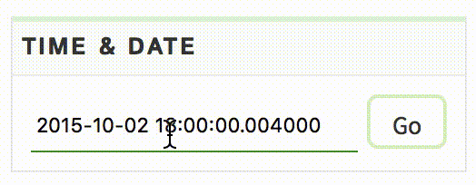
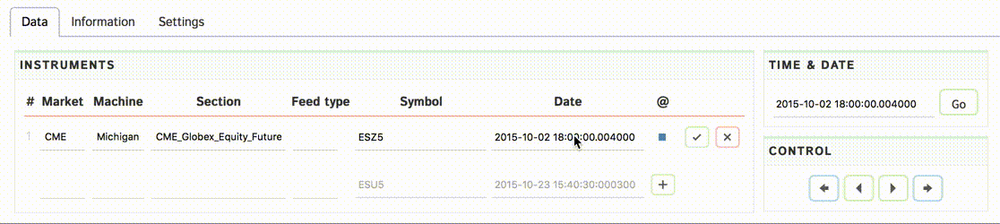

# Viewer

Мы предоставляем вам инструмент для визуализации биржевых торгов - [Web viewer]({{ book["viewer.url"] }}). В нем можно посмотреть, что происходило на выбранном инструменте в любой момент любого дня из набора A. Web viewer доступен по адресу [{{ book["viewer.name"] }}]({{ book["viewer.url"] }}).

**Интерфейс {{book["viewer.name"]}} состоит из нескольких частей:**
- график лучшей цены и сделок
- биржевые стаканы
- панель управления и информации

Разберем каждую их них.

## График
График — это центральная часть аналитического инструмента. По оси X располагается время (по Москве), с точностью до микросекунд, по оси Y — уровень цены биржевого стакана.

Линиями на графике отображается лучшая цена. Красные линии — лучшая цена продажи, зеленая — покупки.

Кроме того, на графике отображаются все сделки, которые были совершены на бирже. На каждую сделку можно кликнуть и узнать, в какой именно момент она была совершена, какой у неё объём и другие параметры.

Иллюстрация работы с графиком выглядит следующим образом. 

](viewer-chart.gif)

## Управление
В Web Viewer реализована симуляция биржевых торгов с последовательным применением событий к биржевому стакану. Для того, чтобы перейти к следующему событию, необходимо нажать на клавиатуре **«→»**, чтобы вернуться, соответственно, **«←»**.

Текущее местоположение показывается в виде вертикальной черты на графике.

Чтобы перейти в определенный момент на графике, можно дважды кликнуть по точке в графике, на которую вам хотелось бы перейти. Другой способ отобразить определенный момент — виджет выбора времени в панеле управления. 

Достаточно выбрать дату и время, которые вы хотите отобразить и нажать кнопку «Go».

## Панель управления

Состоит из трех вкладок: 
- выбор данных
- информация о текущем состоянии
- настройки

## Свои заявки

