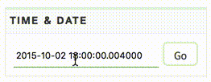

### Viewer

Мы предоставляем вам инструмент для визуализации биржевых торгов - [Viewer]({{ book["viewer.url"] }}).
В нём можно посмотреть, что происходило на выбранном инструменте в любой момент любого дня из тренировочного набора.
Viewer доступен по адресу [{{ book["viewer.name"] }}]({{ book["viewer.url"] }}).

Его интерфейс состоит из следующих частей:

- график лучшей цены и сделок,
- биржевые стаканы,
- панель управления и информации.

Разберем каждую их них подробнее:

- [График](#chart)
- [Управление](#control)
- [Панель управления](#panel)
- [Свои заявки](#orders)

## График

График — это центральная часть аналитического инструмента.
По оси X располагается время (по Москве, UTC+3), с точностью до микросекунд, по оси Y — уровень цены биржевого стакана.

Линиями на графике отображается лучшая цена.
Красные линии — лучшая цена продажи, зеленая — покупки.

Кроме того, на графике отображаются все сделки, которые были совершены на бирже.
На каждую сделку можно кликнуть и узнать, в какой именно момент она была совершена, какой у неё объём и другие параметры.

Иллюстрация работы с графиком выглядит следующим образом.

## Управление

В Viewer реализована симуляция биржевых торгов с последовательным применением событий к биржевому стакану.
Для того, чтобы перейти к следующему событию, необходимо нажать на клавиатуре клавишу "вправо" («→»), чтобы вернуться, соответственно, влево («←»).

Текущее местоположение показывается в виде вертикальной черты на графике.

Чтобы перейти в определенный момент на графике, можно дважды кликнуть по точке в графике, на которую вам хотелось бы перейти.
Другой способ отобразить определенный момент — виджет выбора времени в панели управления.

Достаточно выбрать дату и время, которые вы хотите отобразить, и нажать кнопку «Go».

## Панель управления

Состоит из трех вкладок:

- выбор данных
- информация о текущем состоянии
- настройки

## Свои заявки

В инструменте предусмотрена работа со своими заявками, которые были сгенерированы вашей стратегией.
Для этого нужно перейти в Viewer из графиков контеста.
Тогда у вас появится еще один биржевой стакан, в котором будут находиться только ваши заявки.
Вы можете нажать на объем и посмотреть, какие именно заявки стоят на цене, и когда каждая из них была добавлена.
Кроме того, вы можете перейти на момент постановки заявки, нажав на время в диалоговом окне.

Пример работы со своими заявками.

Ваши заявки так же отображаются на графике.
Чтобы узнать какой у них символ (форма) — достаточно посмотреть в панель управления данными.
Символ заявок будет отображен в колонке «@».
