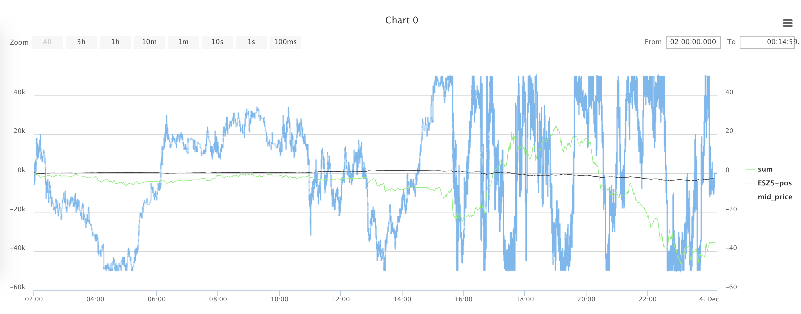
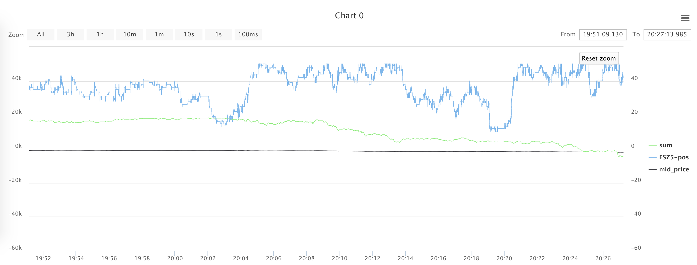

##Идеи для реализации

Несколько простых идей, которые могут привести вас к первой стратегии с положительным результатом:

  - [изучить, как ограничение максимально допустимой позиции влияет на торговлю](#max_executed_amount)
  - попробовать увеличить значение отрицательного результата, при котором стратегия заканчивает торговлю
  - 
  - научиться ставить больше чем 1 заявку на цену (или заявки с бОльшим объемом)
  - если с лучшей цены снимаются несколько заявок, то подумать о том, чтобы тоже сняться
  - ставить заяаки не только на лучшую цену, но и глубже (то есть дальше от спреда) в стакан
  
Рассмотрим некоторые из этих идей подробнее, а также посмотрим, как мы можем к ним прийти.

Запустим стратегию из примеров, которая [стоит на лучшей цене](examples.md#stay_on_best_price), и посмотрим на график торгов на 3 декабря (для наглядности нарисовали собственный график - график цены инструмента (минус 208000, чтобы цена и текущий результат были примерно в одном диапазоне)):

Видно, что если мы закупились, то распродаем все очень нескоро, и наоборот. Посмотрим на кусочек дня поближе:

На втором графике видно, что цена уменьшалась (суммарно примерно на 400 долларов). При этом мы были закуплены все это время, и наш результат соответственно по большей части падал. Понятно, что могло быть ровно наоборот, и результат мог расти. Однако понятно, что это случайность, и таких ситуаций стоит избегать. В случае, когда мы стоим одним лотом на лучшей цене, можем попробовать ограничить максимальную позу величиной 1, 5 или 10 (за это отвечает переменная в конфиге *max\_executed\_amount*, которую также можно задать как параметр при посылке). Попробуйте сами и убедитесь, что это сильно влияет на текущий результат!

